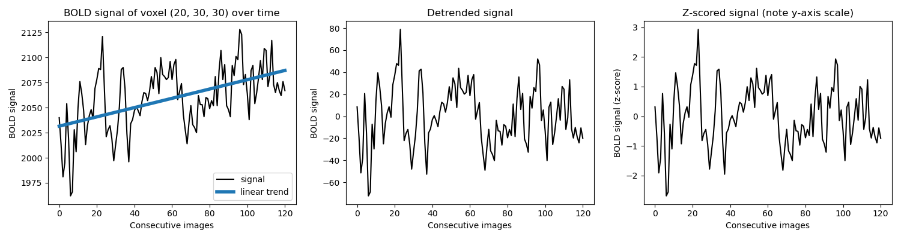
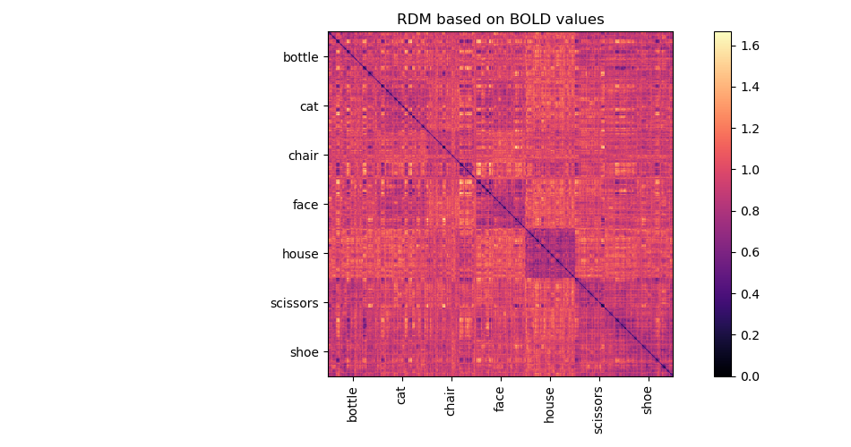
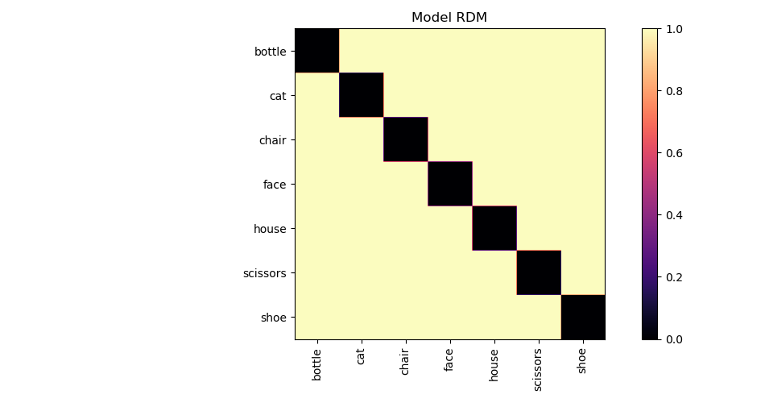
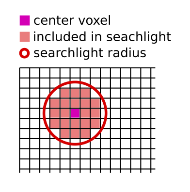
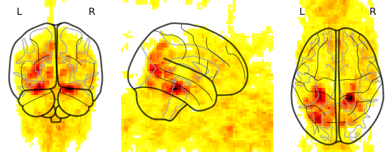
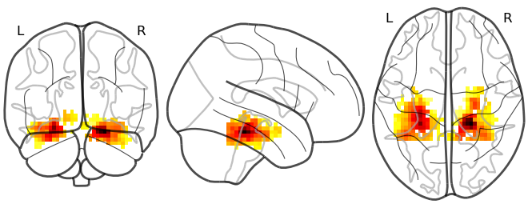

.. warning::
    The analysis pipeline described below takes very inappropriate shortcuts, so you are hopefully able to program it in a single day.
    Do not use this analysis pipeline in an actual study!

======================================
Overview of the data analysis pipeline
======================================

The goal of the analysis is to find areas in the brain that seem to be related to semantics.
To find them, we will use an fMRI dataset [Haxby2001]_ in which the participants were shown pictures of different objects, namely:
*bottle, cat, chair, face, house, scissors, shoe*.
By hunting for areas in which the BOLD signal discriminates between the different object categories, we can find areas that seem sensitive to the semantic content of the images.
The metric of how well the signal discriminates will be computed using RSA.
Described in [Kriegeskorte2008]_, RSA is a technique to compare how a set of stimuli are represented in two different signals.
Confusing terminology notwithstanding, the technique is relatively simple.

Pre-processing
--------------

Since we are aiming for an analysis pipeline that can be implemented in a single day (and without the help of fancy toolboxes), we will only do very basic pre-processing of the data.
We will remove the linear trend over time and Z-score the data (=remove mean, make standard deviation be 1).

The data was recorded in 11 "chunks", where each chunk of the experiment lasted a couple of minutes, with a short break in between.
Each chunk should be pre-processed separately.

Building a BOLD signal RDM
--------------------------

The core of the RSA technique is a concept called a representational dissimilarity matrix (RDM).
This is a (items x items) matrix which contains for each possible pair of items, a score of how *dis*\ similar the signal is (i.e. a low score means that the signals are similar).
This score can be computed in many different ways, but for this assignment, we will stick with Pearson correlation.

In this assignment, you will be computing the dissimilarity between fMRI BOLD images.
For example, say we have one image taken when the participant was looking at a *face* (``bold_face``) and one where they were looking at a *house* (``bold_house``).
Both BOLD images have the same grid of (40 x 64 x 64 = 163840) voxels.
First flatten both images to vectors of length 163840, then:
``dissimilarity = 1 - pearson_correlation(bold_face, bold_house)``.
Repeat this for all possible combinations of two BOLD images to obtain the full (images x images) RDM matrix. Here is what it looks like:

Notice how the diagonal is all zeros. Answer for yourself: what does the diagonal represent and why would it always be zero?

Building a model RDM
--------------------

Since our goal is to hunt for areas which seem to encode semantics, we will compare the RDMs created from the BOLD signal to an RDM that represents our criterion of "distinguishes between object categories".
This "model" RDM, we will build manually.
It will need to have the same dimensions as the RDM based on the BOLD signal, so (images x images).
Its contents will be either 0's or 1's, depending on whether the images were taken for stimuli belonging to the same object category or not.
Here is what it looks like:

Representational similarity analysis (RSA)
------------------------------------------

Now that you understand what an RDM is, explaining RSA is easy:
RSA is making two RDMs and comparing them with each other.
For this comparison we compute a similarity score (rather than *dis*\ similarity).
Again, many ways to do this, but for this assignment, we will stick to Spearman rank correlation.
So, for example, to compare two RDMs as computed above, we first flatten them into vectors and then compute ``rsa_score = spearman_correlation(rdm1, rdm2)``.

If we compute RSA between the model RDM and the RDM created from the BOLD signal, we get a single score indicating how similar they are.
For the example RDM matrices, their RSA score is around 0.25.
If the RSA score is high, that means the BOLD signal is distinguishing between object categories well.
If the RSA score is low, not so much.

Searchlight analysis
--------------------

Our goal is to find areas for which the BOLD signal discriminates between the different object categories.
Hence, we will not be computing RDMs using all voxels, but rather a selection of voxels belonging to a specific area.
Specifically, we will make RDMs using small spherical subsets ("searchlights") centered on every voxel:

We pick a voxel and create a searchlight around it using a radius of 2 voxels (hence a diameter of 5 voxels: the center voxel and 2 voxels in each direction).
The radius should be a parameter that you can easily change.
Then we use only the selected voxels to compute an RDM (27 voxels when the radius is 2).
This RDM is then compared to the model RDM and the resulting RSA score is assigned to the voxel at the center of the searchlight.
By repeating this procedure for every voxel in the images, we can create a complete map of RSA values, which would look something like this:

Of course, you probably want to skip computing RSA values for voxels outside the brain.
In fact, to avoid overly lengthy computations, we will in this assignment limit
the analysis to a small region of interest in the temporal cortex:

References
----------

.. [Haxby2001] Haxby, J. V., Gobbini, M. I., Furey, M. L., Ishai, A., Schouten,
   J. L., & Pietrini, P. (2001). Distributed and overlapping representations of
   faces and objects in ventral temporal cortex. Science, 293(5539), 2425–2430.
   https://doi.org/10.1126/science.1063736

.. [Kriegeskorte2008] Kriegeskorte, N., Mur, M., & Bandettini, P. A. (2008).
   Representational similarity analysis—Connecting the branches of systems
   neuroscience. Frontiers in Systems Neuroscience, 2(November), 4.
   https://doi.org/10.3389/neuro.06.004.2008
